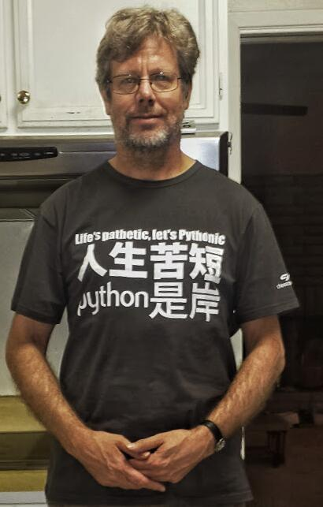

# python 入门

## 一. python 简介

- 本节目标:
  - 了解 Python 的起源
  - 了解 Python 的设计目标
  - 了解 Python 的设计哲学
  - 了解 Python 的特点
  - 了解 Python 的优缺点

### 1. Python 的起源

- Python的创始人为荷兰人吉多·范罗苏姆（ Guido van Rossum ）。

- 1989年圣诞节期间，在阿姆斯特丹，Guido 为了打发圣诞节的无趣，决心开发一个新的脚本解释程序，作为 ABC 语言的一种继承。
- ABC 是由 Guido 参加设计的一种教学语言。就 Guido 本人看来，ABC 这种语言非常优美和强大，是专门为非专业程序员设计的。但是 ABC 语言并没有成功，究其原因，Guido 认为是其非开放造成的。Guido 决心在Python 中避免这一错误。同时，他还想实现在ABC 中闪现过但未曾实现的东西。
- 之所以选中 Python（大蟒蛇的意思）作为该编程语言的名字，是取自英国20世纪70年代首播的电视喜剧《蒙提.派森的飞行马戏团》（Monty Python's Flying Circus）。

### 2. Python 的设计目标

- 一门简单直观的语言并与其他竞争者一样强大
- 开源，以便任何人都能为它作贡献
- 代码像纯英语那样容易理解
- 适用于短期开发的日常任务

### 3. Python 的设计哲学

- 优雅，简单，明确
- 用一种方法，最好是只有一种方法来做一件事

### 4. Python 的特点

- Python 是一个完全面向对象的语言
- Python 拥有一个强大的标准库
- Python 社区提供大量的第三方模块

### 5. Python 的优缺点

- 优点：
  - 简单，易学
  - 免费，开源
  - 开发效率高
  - 可以执行性
  - 面向对象
  - 可扩展性

- 缺点：
  - 运行速度慢
  - 线程不能利用多 CPU 问题